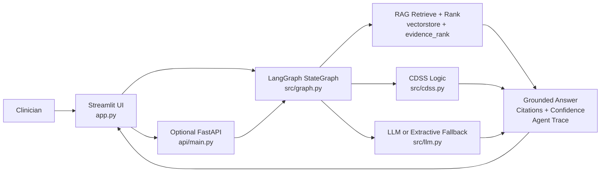
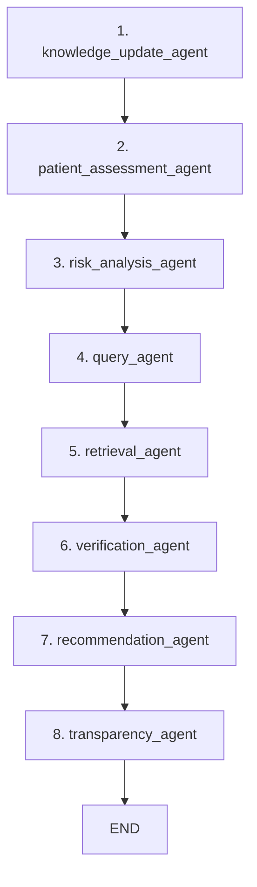
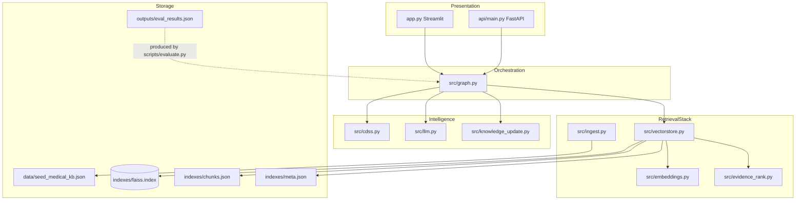
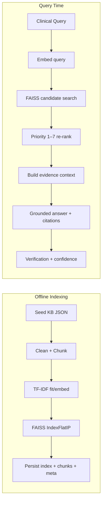
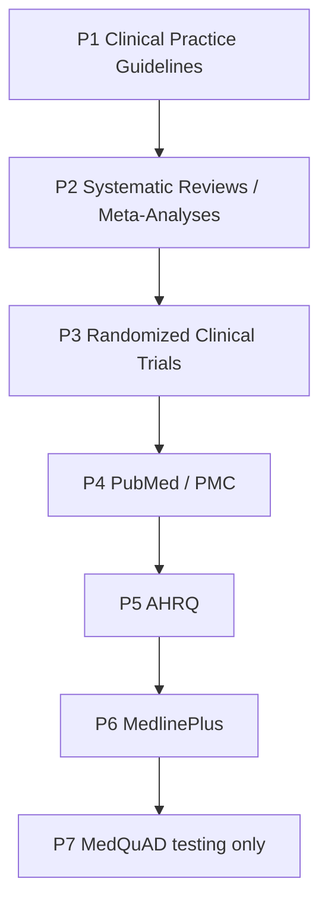
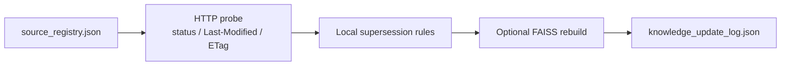

# System Architecture — Milestone 2 Technical Design

**Project:** Source-Linked Clinical Evidence CDSS  
**Repository:** https://github.com/Audrey2023uh/Audrey_HealthCareAI  
**Status:** Research / education prototype — **not a medical device**

This document is the **technical design map** for readers, instructors, and demo presentation.  
It explains:

1. How the system is designed  
2. How components interact  
3. Why tools were chosen  
4. Cost / complexity / scalability trade-offs  
5. Implemented (yellow) vs ideal (green)  
6. Code map  
7. Results and metrics from real outputs  

> Architecture figures also appear in `Milestone2_HealthcareAI_V2.pptx` (Figures 1–9).  
> This page renders the same design logic directly on GitHub.

---

## 1. End-to-end system design (what a request touches)

**In plain language:**  
The clinician enters patient fields + a clinical question. The request enters an **8-node LangGraph workflow**. Evidence is retrieved from FAISS, re-ranked by clinical priority, verified, and turned into a source-linked recommendation with transparency.

---

## 2. LangGraph execution graph (actual 8 nodes)

Implemented in `src/graph.py` as a linear `StateGraph`:

| Node | Responsibility | Key code |
|------|----------------|----------|
| Knowledge Update | Optional URL probes / local supersession | `src/knowledge_update.py` |
| Patient Assessment | Merge form + text-extracted fields | `src/cdss.py` |
| Risk Analysis | HTN/obesity/preventive needs (prototype) | `src/cdss.py` |
| Query Agent | Normalize/classify; optional LLM rewrite | `src/graph.py` |
| Retrieval | FAISS search + Priority 1–7 re-rank | `src/vectorstore.py`, `src/evidence_rank.py` |
| Verification | Conflicts, citations, confidence, review flag | `src/graph.py`, `src/cdss.py` |
| Recommendation | Structured recs + evidence summary | `src/cdss.py` |
| Transparency | Final narrative + agent_trace | `src/graph.py` |

Shared state lives in `GraphState` (`question`, `hits`, `context`, `confidence`, `agent_trace`, timings, etc.).

---

## 3. Component interaction & data flow

### Why these tools were chosen

| Choice | Why chosen for Milestone 2 | Ideal upgrade later |
|--------|----------------------------|---------------------|
| **LangGraph** | Clear agent boundaries + shared state + demoable agent_trace | Managed workflow orchestrators |
| **FAISS** | Real local vector retrieval; easy to prove | Managed vector DB / hybrid search |
| **TF-IDF (default)** | Offline, deterministic, install-safe | Neural embeddings + re-ranker |
| **Priority 1–7 ranking** | Clinical trust > pure similarity | Learned clinical re-ranker |
| **Streamlit** | Fast clinician demo UI | React/Next.js production console |
| **Extractive fallback** | Demo works without API keys | Stronger grounded LLM + eval harness |
| **Optional OpenRouter/OpenAI-compatible LLM** | Better fluency when available | Enterprise clinical LLM + governance |
| **Optional FastAPI** | Same pipeline as HTTP API | Authenticated multi-tenant API gateway |

---

## 4. RAG pipeline (indexing + query-time)

**Implemented retrieval path:**

Query → embedding → FAISS retrieval → evidence ranking → context construction → grounded response → citation/verification

---

## 5. Evidence hierarchy (Priority 1 → 7)

Implemented in `src/evidence_rank.py`:

Additional controls:
- hard sort by priority first, then quality within tier  
- superseded sources penalized  
- active guidelines preferred in the final window  

---

## 6. Implemented vs ideal architecture

```mermaid
flowchart LR
  subgraph Yellow_Implemented["YELLOW = Implemented now"]
    Y1[Local JSON KB]
    Y2[TF-IDF + FAISS]
    Y3[LangGraph 8-node CDSS]
    Y4[Streamlit UI]
    Y5[Optional LLM / extractive fallback]
    Y6[URL probe Knowledge Update]
    Y7[Local eval JSON]
  end

  subgraph Green_Ideal["GREEN = Ideal future"]
    G1[Managed clinical KB + vector DB]
    G2[Neural embeddings + re-ranker]
    G3[Production workflow + monitoring]
    G4[React clinician console]
    G5[HIPAA cloud + auth]
    G6[Automatic guideline PDF ingestion]
    G7[Continuous groundedness eval]
  end

  Yellow_Implemented -.->|roadmap not claimed as finished| Green_Ideal
```

### Trade-offs (cost · complexity · scalability)

| Dimension | Implemented (yellow) | Ideal (green) |
|-----------|----------------------|---------------|
| **Cost** | Near $0 local path; optional low-cost LLM | Paid embeddings, managed search, cloud BAA costs |
| **Complexity** | One Python repo; easy to run and grade | Many services, auth, EHR/FHIR, ops ownership |
| **Scalability** | Fine for 19-doc prototype KB | Needed for multi-clinic production load |

---

## 7. Knowledge Update — honest scope

**Implemented:** URL probes, status checks, Last-Modified/ETag tracking, local supersession, optional index rebuild.  
**Not implemented (ideal):** automatic ingestion of every new society guideline PDF; continuous production clinical governance.

---

## 8. Code map (what to open during presentation)

| Show this file | To prove |
|----------------|----------|
| `src/graph.py` | 8-node LangGraph StateGraph + edges + agent_trace |
| `src/vectorstore.py` | FAISS build/load/search |
| `src/embeddings.py` | TF-IDF default embedder |
| `src/evidence_rank.py` | Priority 1–7 ranking + superseded penalty |
| `src/cdss.py` | Patient/risk/recommendation logic |
| `src/knowledge_update.py` | URL probe prototype |
| `src/llm.py` | Optional LLM + extractive fallback |
| `app.py` | Clinician UI + KPIs + tabs + trace |
| `api/main.py` | Optional `/ask` API |
| `scripts/evaluate.py` | Metrics generation |
| `indexes/meta.json` | Corpus statistics |
| `outputs/eval_results.json` | Evaluation results |
| `Milestone2_HealthcareAI_V2.pptx` | Full technical slide deck |

---

## 9. Results & metrics (from real project outputs)

Sources:
- `indexes/meta.json`
- `outputs/eval_results.json`
- configured `TOP_K=5` in `src/config.py`

### Indexed corpus

| Metric | Value |
|--------|------:|
| Documents | **19** |
| Chunks | **20** |
| Embedder | `local:tfidf` |
| Ranking policy | priority 1→7 then quality within priority |
| Superseded docs flagged | 1 |

### Demo evaluation set (`scripts/evaluate.py`)

| Question theme | Retrieved chunks (`n_chunks`) | Citation precision | Confidence |
|----------------|-------------------------------:|-------------------:|-----------:|
| ASCVD statin intensity | 4 | **1.00** | 0.73 |
| A1C target (T2DM) | 4 | **1.00** | 0.73 |
| USPSTF hypertension screening | 5 | **1.00** | 0.65 |

**How to say this correctly in presentation:**
- **Citation precision = 1.00** on the demo eval set  
- **Configured top-k = 5** (default retrieval window)  
- Actual returned chunk counts in this eval run were **4, 4, and 5** — not always exactly 5  
- Indexed corpus = **19 documents / 20 chunks**

### Qualitative result

RAG answers include source-linked chunks and an audit trail.  
A plain LLM without retrieval has no retrieval audit trail and higher risk of invented references.

---

## 10. What to show live (design → code → results)

1. Open this page on GitHub and walk Figure sections 1–3 (design).  
2. Open `src/graph.py` and show the 8 `add_node` / `add_edge` calls (code).  
3. Run Streamlit and show evidence tiles, citations, confidence, agent trace (results).  
4. Open `outputs/eval_results.json` and `indexes/meta.json` (metrics).  
5. Restate yellow vs green so implemented work is never confused with ideal future work.

---

## Disclaimer

This system is a university research/education prototype for AI-engineering demonstration.  
It does not provide medical advice and must not be used as a clinically validated decision tool.
